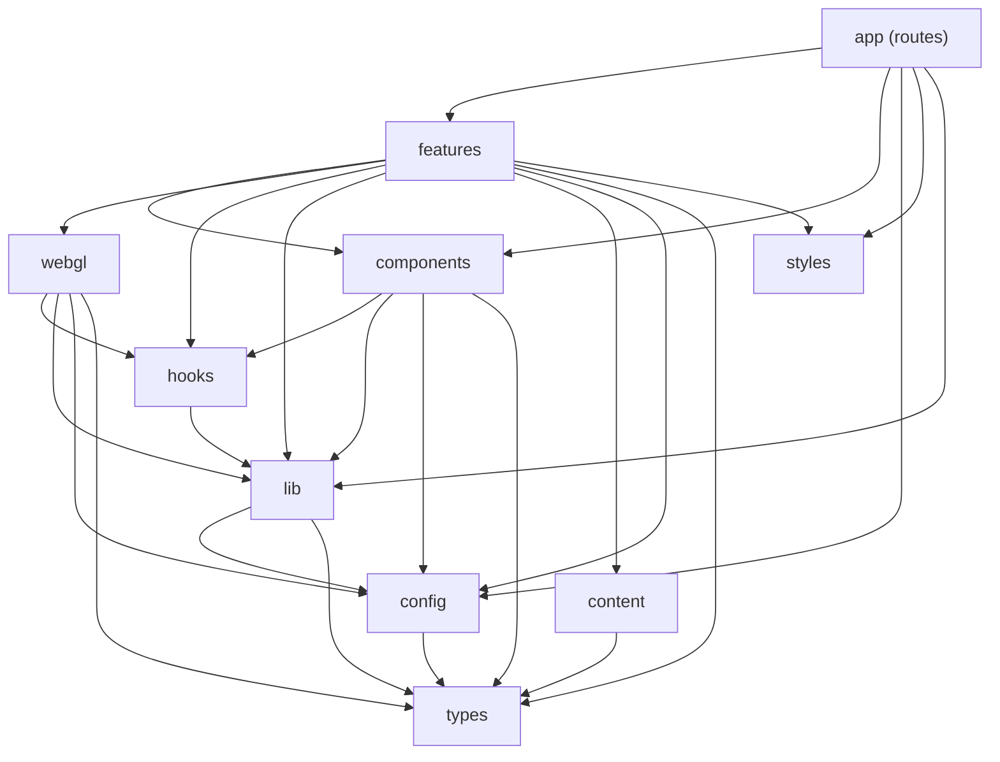

# Architecture

## Layers

| Layer         | Path                      | May import                                                                                                          |
| ------------- | ------------------------- | ------------------------------------------------------------------------------------------------------------------- |
| app           | `src/app`                 | `features/*` (via `index.ts` only), `components`, `config`, `styles`, `lib`                                         |
| features      | `src/features/*`          | other features (via `index.ts` only), `components`, `webgl`, `hooks`, `lib`, `styles`, `content`, `config`, `types` |
| components    | `src/components`          | `hooks`, `lib`, `styles`, `config`, `types`                                                                         |
| webgl         | `src/webgl`               | `hooks`, `lib`, `config`, `types`                                                                                   |
| hooks         | `src/hooks`               | `lib`, `config`, `types`                                                                                            |
| lib           | `src/lib`                 | `config`, `types`                                                                                                   |
| content       | `src/content`             | `types`                                                                                                             |
| config        | `src/config`              | `types`                                                                                                             |
| styles, types | `src/styles`, `src/types` | nothing                                                                                                             |

Rules, enforced in `eslint.config.mjs`:

1. `app` uses features only through `features/<name>/index.ts`.
2. Dependencies flow one way (table above); anything not listed is rejected (`default: "disallow"`).
3. Shared layers never import from `features/` or `app/`.
4. A feature never deep-imports another feature.

`pnpm prove:boundaries` demonstrates each rule failing against a real violating import.



## Rendering

- Every route is **statically prerendered** (`generateStaticParams` for slugs). Unknown slugs 404.
- Pages are Server Components. Client components are limited to interaction and motion: `Header`/`MobileMenu`, `ContactForm`, the motion wrappers, `Cursor`, `SmoothScrollProvider`.
- Motion is progressive: content is server-rendered visible; GSAP, ScrollTrigger and Lenis are code-split into one lazy chunk (`components/motion/drivers.tsx`, loaded via `next/dynamic` after the browser is idle) so they never block first paint. Elements already in view when the drivers start are not re-animated.
- Client components import `config/navigation.ts`, never `config/site.ts` (which pulls in the zod env).
- Data: pages call feature repositories (`getProjects()`, `getService(slug)` …), which read `src/content/`. See ADR 0004.
- WebGL: one shared canvas, mounted only on WebGL routes (ADR 0002).

## Providers

```
RootLayout (fonts, <html>)
└─ (site)/layout  →  <Providers>                      components/providers/Providers.tsx
                      └─ SmoothScrollProvider          Lenis ⇄ GSAP ticker ⇄ ScrollTrigger (idle-loaded)
                         ├─ ScrollProgress, Cursor      motion drivers (idle-loaded)
                         ├─ Header (+ MobileMenu)
                         ├─ <main><PageTransition>{page}</PageTransition></main>
                         └─ Footer
(dev)/hero-lab  →  no site chrome, no smooth scroll
```

## Design tokens

`src/styles/tokens.css` is the single source for colour, radii, shadows, easing and z-index. `@theme static` both emits the CSS custom properties and generates Tailwind utilities (`bg-bg`, `text-ink`, `rounded-pill`, `ease-out-expo` …). Typography, spacing and breakpoints follow the same pattern. `cn()` is configured so `text-display-*` sizes survive `tailwind-merge` next to colour utilities.

## Decisions

See [`adr/`](adr/).
